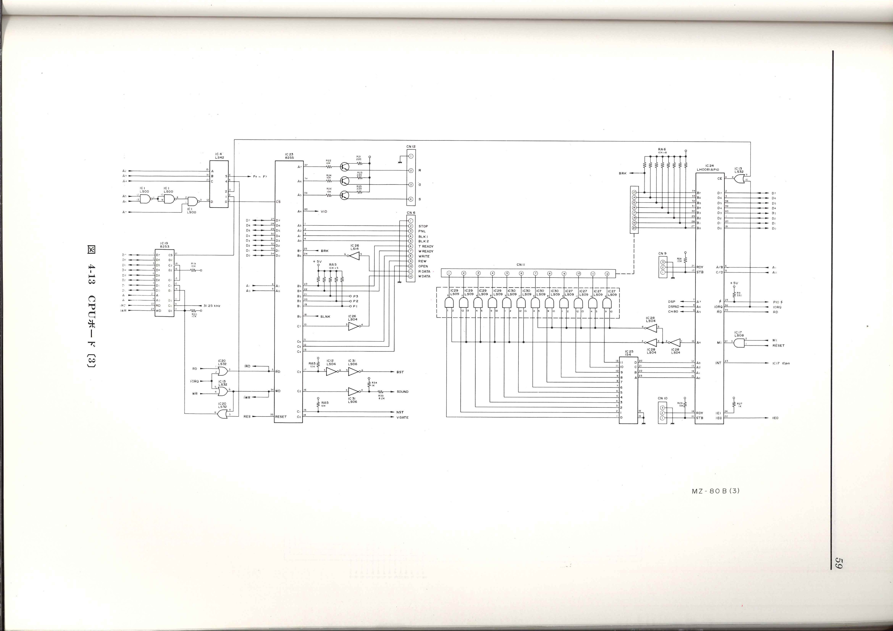
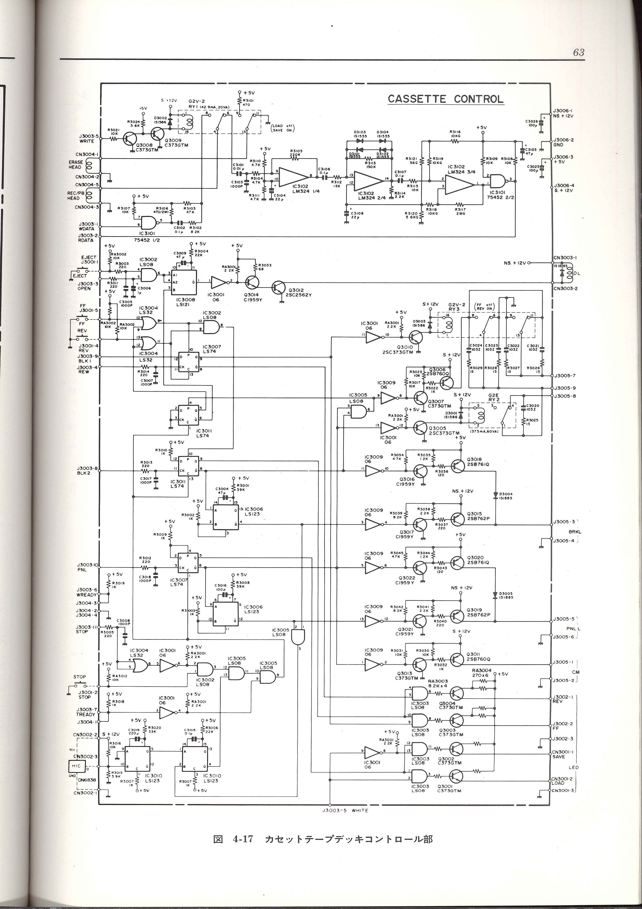
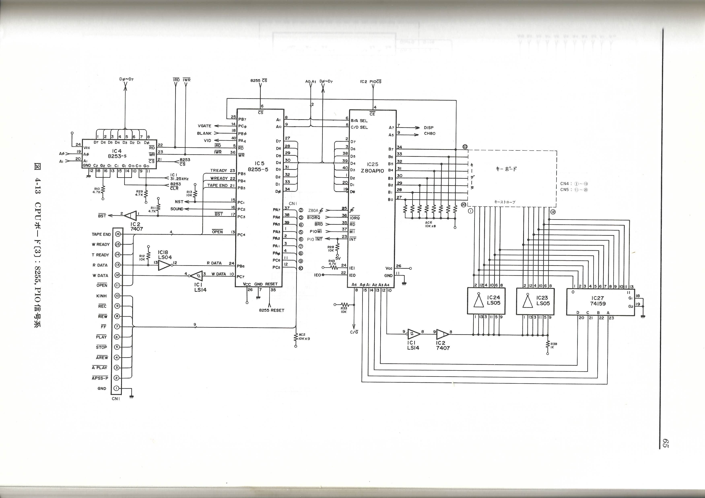
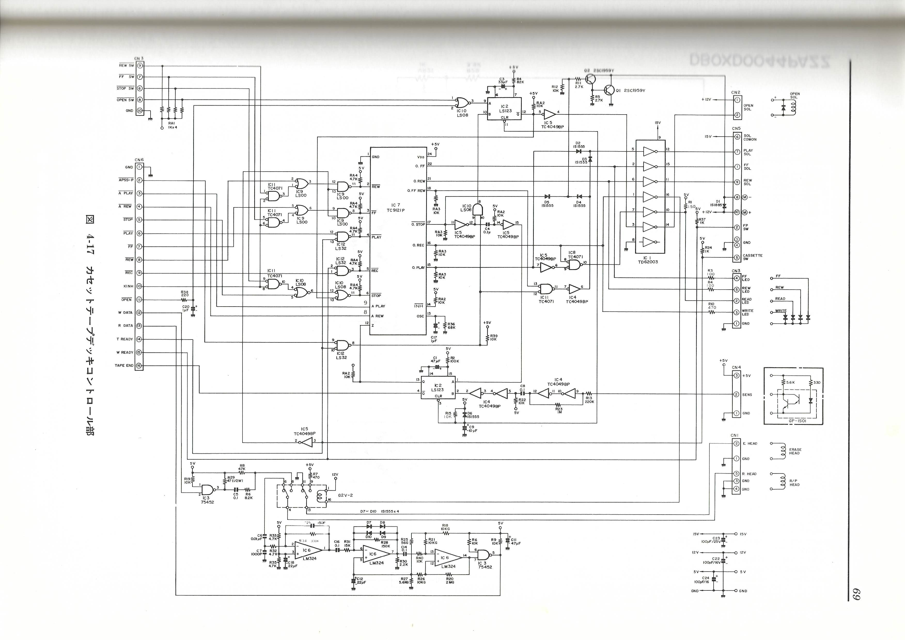

# MZ-80BとMZ-2000のCMT制御信号について

MZ-80BとMZ-2000は8255のPORTでCMT制御を行います。
読み込みデータや書き込みデータなどは割愛し、まずMZ-80Bのテープの制御信号につて記載します。

MZ-80BのオーナーズマニュアルにあるCMT周りの回路図をみるとおおよその動作はわかります。

それぞれの8255のポート（ピン番号）とマニュアル中の信号名は以下です。

PA0(4)	BLK2

PA1(3)	BLK1

PA2(2)	PNL

PA3(1)	STOP

PC4(13)	OPEN

PC5(12)	REW

PC6(11)	WRITE

回路図を見ながらのほうがわかりやすいと思いますので、オーナーズマニュアルを所有している方は、CMTの制御回路のところを参照ください。

まず、BLK1,BLK2,REW,PNLは74LS74のフリップフロップに入っています。
BLK1とREWはIC3007の74LS74に、DとしてBLK1、CKとしてREWが入力されています。
BLK2はIC3011にCKとして入力されています。
PNLはIC3007のCKとして入力されています。

これらはすべてSTOPによってクリアされます。（STOPがすべてのフリップフロップのCLRに入っている）

BLK1はテープの走行方向を順方向（FF）か逆方向（REV）かの方向を指定する信号です。BLK1をHにするとFF,LにするとREVとなります。
このBLK1を出力し続けた状態で、REWをLからHに変化させると、フリップフロップなのでラッチされます。
ラッチした状態で、BLK2をLからHに変化させると、ピンチローラーと回転軸はタッチしない状態での、高速なモーターの動作が開始され、FFもしくはREVになります。
ヘッドはテープに接触している状態ですので、この状態がMZ-2000でいうAPSSのモードになります。（高速な頭出しが可能）
これらのラッチされた信号はすべてSTOPの信号がくるとリセットされます。

PNLはカセットテープを通常のPLAY（READ)もしくはREC(WRITE)の状態で動作させます。
PNLをHとする前にテープ走行方向をFFにしておく必要があるので、BLK1をHにしながらREWをH、Lとしてラッチさせておく必要があります。
その後にPNLをH、Lとすると、ピンチローラーがタッチし、PLAYもしくはRec状態でのテープ走行が始まります。

このように、いくつかの信号の組み合わせでテープの動作を制御しているのがMZ-80Bです。
MZ-80BのIPL及びSB-5520のBASIC、いくつかのゲームを調査したところ、１つの信号がアサートされている時間はおおよそ299ms程度で、次の信号まで一旦ネゲートされている時間も299msでした。
当然ですが、連続した動作をしない場合はネゲートしている時間になります。
１つだけ例外があり、IPL終了時のREVの動作だけ、最後のモーター動作開始でのBLK2が5us程度しかアサートされていませんでした。
これは直後にIPLからAllRAMモードにリセットをする過程で8255もリセットされてしまうためと回路図とIPLのコードからは予想されます。
一般的な74LS74のデータシートでは、Switching CharacteristicとしてMaxでも40ns程度となっていますので、これぐらいでも動作速度として問題ないと考えられます。

またテープ動作の変更をしない（もしくは動作継続中）defaultの状態はBLK1がHでそれ以外はLの状態でキープされています。


次にMZ-2000のCMT制御について記載します。
8255を介してテープの制御回路へ入出力を行っていることは同一ですが、テープの制御自体を東芝のTC9121Pというテープデッキコントローラーを使って制御しています。
ですのでテープ制御は8255からTC9121Pへの信号を出力してい動作させており、追加の回路でAPSSの制御を行っています。
MZ-2000の回路図と[TC9121P](images/TC9121P)のデータシートを参照してください。

実際の信号ですが、MZ-2000のオーナーズマニュアルにある8255のポートと信号名は以下です。

PA0(4)	_REW

PA1(3)	_FF

PA2(2)	_PLAY

PA3(1)	_STOP

PA5(39)	_AREW

PA6(39)	_APLAY

PA7(37)	_APSS-P

PC5(12)	KINH

PC6(11)	_REC

PB3(21)	TAPE END

信号が負論理になっているのはTC9121Pが負論理のためだと思います。
_REWなどは名前のままなのでよいかなと思います。

_AREWと_APLAYについてですが、TC9121Pのデータシートにでは、TC9121PのX(11),Y(10),Z(12)の入力の状態で動作が変化します。

この内、Zはテープの動作中はH、停止するとLになる、PB3のTAPE END信号の反転したものです。
X,Yに関してはMZ-2000ではOFF（NC)ですのでTC9121Pのデータシートから以下のことがわかります。

両方ともHの場合、FF,REW,PLAYの動作は通常通りテープの終端に到達すると停止します。

_AREWのみLの場合、FFとREWはテープの終端で停止し、PLAYはテープの終端にくるとREW動作になります(そのREWではテープの終端で停止します）

_APLAYのみLの場合、PLAY,FFはテープの終端で停止し、REWでテープの終端で停止した後、PLAY動作になります。（そのPLAY動作は終端で停止します。）

_APLAY,_AREWともにLの場合、FFは影響を受けず、PLAYで終端まで行った後はREW動作になり、REWで終端に来た後はPLAYになります（PLAY,REWを繰り返す）

_APSSの信号はPLAYソレノイド（テープのヘッドをテープに接触させる）をオン、オフさせるための信号です。
当然PLAYやRECでは_APSSに関係なくソレノイドはオンになりますが、それ以外FFやREW中でオンにしてテープの早送り、プログラムの頭出しなどに使います。
タイミングはオーナーズマニュアルに書いてあるとおりで動作しますが、IPL、MZ-1Z001のBASIC、いくつかのゲームで調査してみました。
いずれもMZ-80Bとほぼ同様に、1つの制御信号を299ms程度アサート後、299ms程度ネゲートした後、次の信号を299ms程度アサートするということを繰り返していました。
APSS信号はマニュアルには40ms以上と記載がありますが、BASICでは50ms程度、他のゲームなどでは60ms程度アサートされていました。
そしてAPSSをネゲートすると同時にFFもしくはREWを299ms程度アサートすることで、APSS動作に入っています。

最後にTAPE ENDですが、回路図では74LS123の単安定マルチバイブレーターの出力が8255へ入っています。
テープカウンターの停止状態をB入力としており、再トリガまでの時間tw(ns)=0.33*100(kohm)*4.7*10^6(pF)となり
tw(ns)=1551000000で約1.55秒になります。
この時間テープ動作が停止するとTAPE ENDがアサートされます。

以上のような動作がわかりましたので、MZ-2000からのテープ動作を一旦AVR（ATmega328など）で受けて変換を行い、MZ-80Bの制御信号として出力する形で作成しました。

この実装でほとんどのソフトで動作したのですが、TONKYでうまく動作しませんでした。
TONKYのIPLからの動作を追いかけてみると、

```
LD A,xx
OUT(E0),A       ;  11clk
OR yy           ;  7clk
OUT(E0),A       ;  11clk
```

というようなコードがあり、信号をアサートしている間隔が4MHzの18clk、4.5usしかありませんでした。
AVRのピン変化割り込みは8MHzの内部クロックで動作している場合、割り込み処理開始まで3us程度しかなく、最悪取りこぼす可能性が高いと考え、Atmegaは外部クロックの20MHz動作をさせるように変更しました。

ちなみにZ80の最短の場合
```
OUT (n),A       ; 11clk
LD A,B          ; 6clk
OUT (n),A       ; 11clk
```
が最短で、8255からのGPIO出力は17clkで変化することになります。


