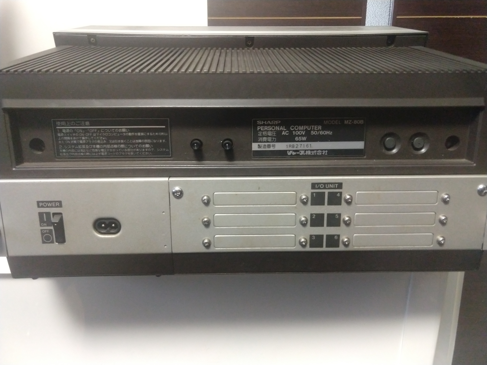

# 取り付け方法 
頒布したセットの取り付け方法を記載します。画像はクリックすると別タブで大きい画像で表示されます。

まずMZ-80B本体の電源を確実に切り、電源ケーブルを外してください。

次に背面二ヶ所のネジを外し、CMTとモニター部分を上方へ押し上げ、本体をあけます。

CMTとモニター部分のカバーを5箇所のネジを外して開けます。

この際、モニター周囲は高圧が掛かっている可能性が高く、注意してください。最悪、指に穴が空きます。

写真にあるCMT制御基板のコネクターを外します。これはテープカウンターの動作信号が入ってくるところで、これでテープが回転しているかを入力しています。

ここにセットのケーブルをつけて取り込みます。

ケーブルはCMT基板のすぐ下にある、電源からのコードが通じている穴を通して、メインのマザーボード側へ誘導します。

この段階でCMTとモニター部分のカバーを元通り取り付けます。ネジで止めても問題ありません。

次にマザーボード側の取り付けを行います。
拡張I/OボードのMZ-8BKが取り付けられている場合、これを外さないとマザーボードが取り外せません。
まず、拡張I/Oボード背面のパネルを取り外します。

次に拡張I/Oボード用の電源を引き抜き、マザーボードと固定されているネジを取り外して引き抜きます。

マザーボードを取り外します。
マザーボードから伸びている、電源コード、CMT、キーボード、CMTコントロールボタン、リセット、ディスプレイ信号などのケーブルをすべて取り外します。取り外しには力が必要だったり、爪で固定されているなどしているので、上手く外してください。

次にマザーボードと背面のパネルを固定してる2箇所のネジを取り外します。

そうすることで、マザーボードを背面にスライドさせることで取り外すことができます。

マザーボードには以下の4枚のカードを取り付けます。

***
*IPL起動時からMZ-2000として起動する基板も追加する場合は*
*この斜体の項目を追加してください*
*もう一つある、こちらの基板をIC8 BOOT-ROMの場所に取り付けます。*

*こちらには27C32などのEPROMにMZ-2000とMZ-80BのIPLをまとめて書き込んだものを取り付けます。*
*EPROMの詳細は[IPL.md](./IPL.md)を参照ください*

*こちらから2芯のケーブルを取り付けます。*
****

IC43 G#3にはこの基板を取り付けます。

まず該当のICを取り外してください。このとき、ピン曲がりや折れに注意してください。

基板を写真の向きで取り付け、ICをソケットにはめ込みます。

このパーツ部分はMZ-80Bのキーボードの直下になり、不用意に高さがあるとキーボードの基板に干渉します。
その場合、ショートしたりするため、MZ-80Bが起動しない、キー入力ができないなどの不具合が出ることがあります。
しっかりはめ込んで、もし必要であればICのピン部分をマスキングしてください。（しっかりはめ込めば不要な高さとなるように設計しています）

このときも基板を割らないように、ピンを折らないように注意してください。コネクターには３芯のケーブルを取り付けて、拡張ボード側へ誘導します。

IC2　G#1も同様です。
ICを取り外した後、基板を取り付け、ICを基板上のソケットにはめ込み、5芯のケーブルを取り付けてください。

CN13はGRAMを取り付ける10ピンのところです。

基板を取り付けて8芯のケーブルを取り付けてください。
写真の向きに取り付けます。
MZ-80BのGRAMを取り付けていた場合は、この基板上にあるコネクターにもともとの取り付け向きと同じように取り付けてください
（これはマザーボードなどをもとに戻した後に行います）

最後はIC23　8255です。
これも同じようにピン曲がりなどに気をつけてICを取り外します。

周囲のパーツの関係でこの基板のピンは長く作成しています。
曲がったり折れやすいので注意してはめ込んでください。

同様に8255も基板のソケットにはめ込みます。
こちらには3本のケーブルを挿入します。

4芯ケーブルは良いとして、2ピンのケーブルが２ヶ所あります。
中央の2ピンのコネクターはKINHを出力しています。こちらはCMTコントロールボタンへ向かうケーブルに割り込ませる形のケーブルを装着します。
そしてもう一方の端の2ピンのコネクターには、CMTカウンターの信号を入力しますので、先程CMT基板に取り付けたケーブルをこちらへ誘導して装着します。
この2芯ケーブル2本はマザーを戻してからのほうが良いと思われます。

以上の4枚の基板を装着したら、マザーボードをスライドさせながらもとの位置へ戻し、２ヶ所のネジで止めます。

この状態で、先程取り外したケーブル類をもとに戻していきます。
奥から戻したほうが楽です。

そして、先程取り付けた8255の残り２ヶ所のケーブルを取り付けます。
KINHのケーブルはCMTコントロールケーブルへ割り込ませる形で、CMTカウンターのケーブルとも装着します。

最後にマザーボードの電源ケーブルを取り付けたか確認してください。
マザーボードへの取り付けは完了です。

次に拡張I/Oボードの取り付けを行います。もし拡張I/Oボードを持っていない場合はスキップしてください。

先程と逆に、拡張I/Oボードを取り付け、マザーボードとの間で2箇所のネジ止めを行います。
電源ケーブルをマザーボードへ取り付けます。

後ろのパネルはカードを取り付けるまで閉じないでください。
GRAMのカードを取り付けます。
マザーボードから複数のケーブルを装着する必要があるので、一番上のどちらかに装着してください。
背面から向かって左側がよいと思います。

こちらを装着したら、それぞれのケーブルをそれぞれのソケットへ装着します。

***
*IPLの差し込む部位はこの写真にありません*
***

MZ-80BのGRAMがある場合はこれを取り付けてください。

ここまで行ったら、パネルを閉じてOKです。
CMT、ディスプレイを下へ戻し、ネジ止めしたら終了です。

拡張I/Oボードを所有していない場合、基板はフリーな状態となりますが使用可能です。
40ピンのストレートケーブル（古いIDEのケーブルなど）で拡張I/Oボードの取り付けするコネクターからGRAMへそのままケーブルを取り付けます。

頒布する基板にはケーブル取り付けのピンヘッダは含まれていませんので、ケーブルとピンヘッダを入手してはんだ付けしてください。

問題は電源ですが、外部で+5V電源を供給することで使用できるようにしています。

内部の電源をもらっても良いのですが、拡張I/Oボードへの電源のコネクターが入手できません。
そのほかのマザーからの信号線は同様に取り付けます。
基板がむき出しなのでショートしないようにしてください。

以上です。
お疲れ様でした。
