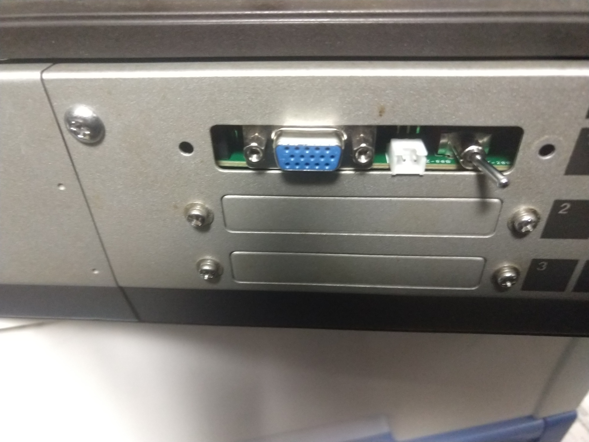
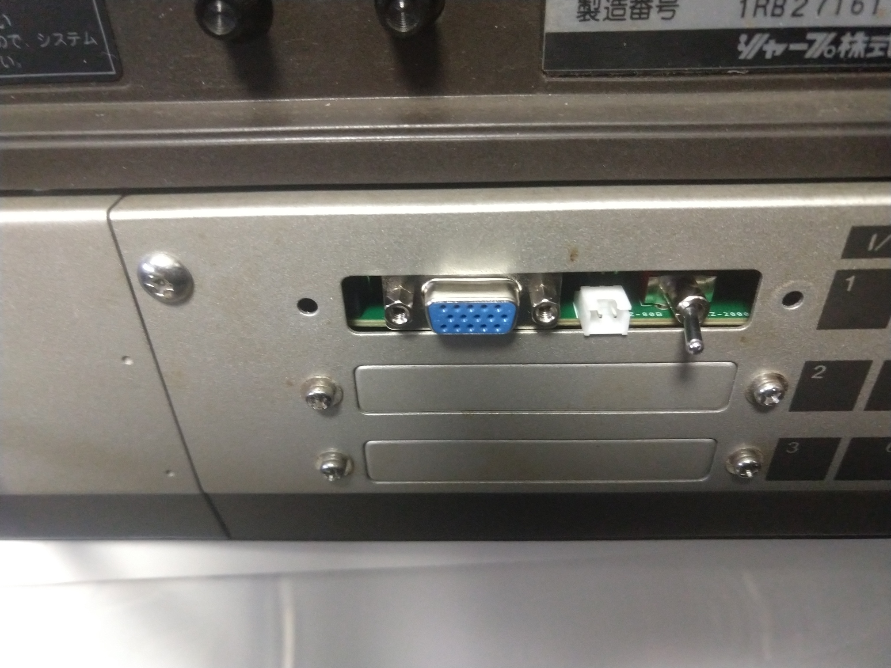
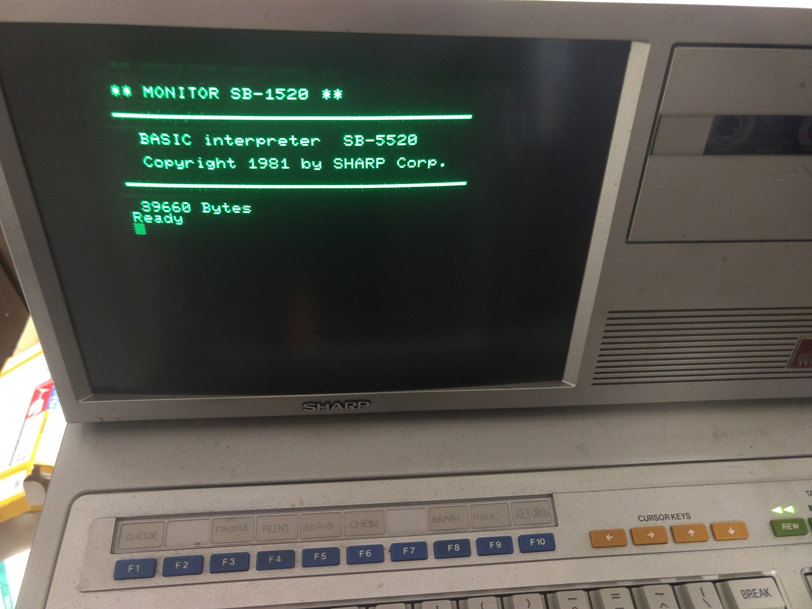
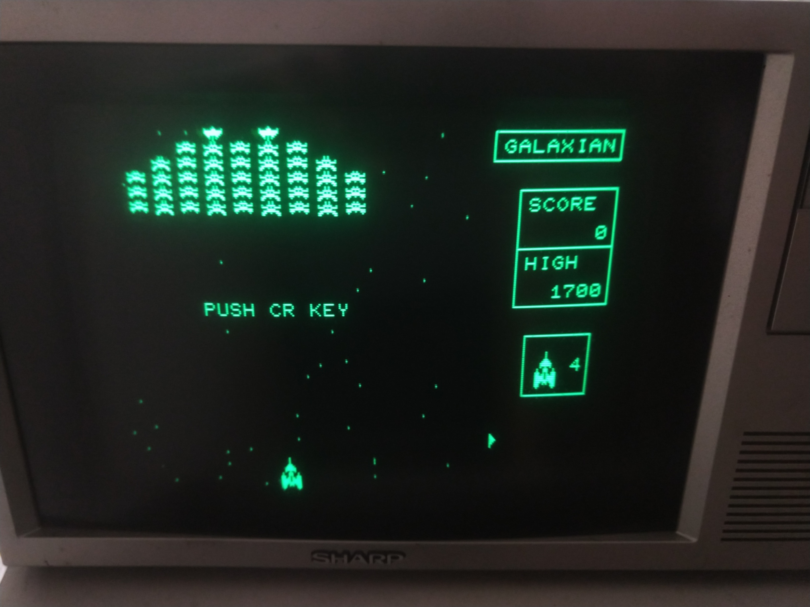
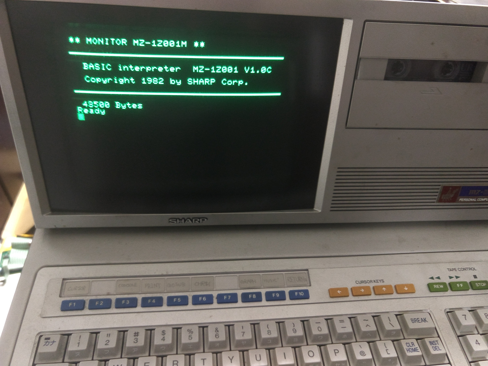
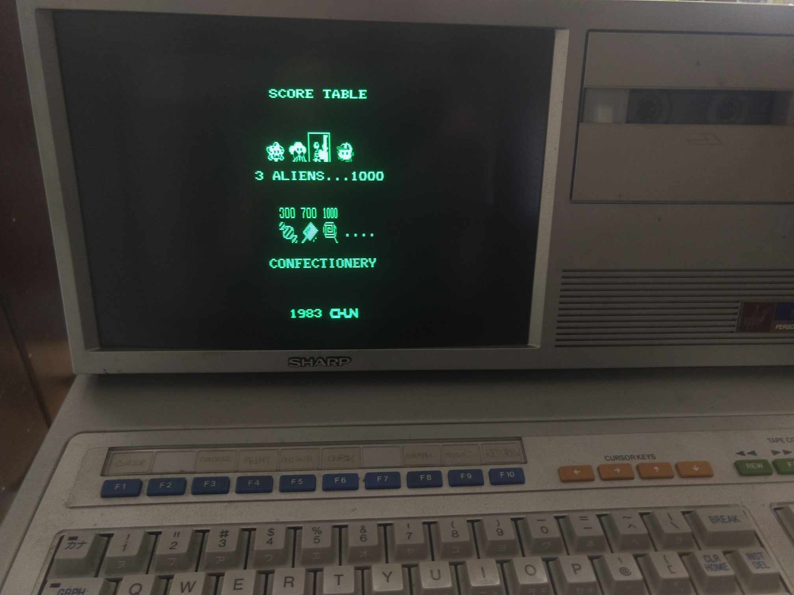

## 使用方法 ##

GRAM背面にあるスイッチを切り換えることで、MZ-80Bとして動作するかMZ-2000としての動作かを切り換えます。

切り換え時は必ず電源を切った状態で行ってください。

MZ-2000モードの際、画面は実機と同様にグリーンモニターと外部モニターに出力されます。
背面にあるminiDsub15ピンとLCDを通常のRGBケーブルで接続してください。

同期信号はもともとのMZ-2000と同様に15KHzが出力されます。
そのため15KHzでHsyncとVsyncの入力を受け付けるLCDを使用する必要があります。

例：

取り付け直後では、まずMZ-80Bモードが動作するか確認してください。
GRAMにあるスイッチをMZ-80B側にして電源を投入します。

CMTが開くとか、CMTを読みに行く、BASICを読み込んだ後に巻き戻す、何かソフトウェアを読み込んで動作を確認するなどしてください。

次にMZ-2000のモードをチェックします。
電源を切った後にスイッチをMZ-2000側に切り換えます。

この状態で電源を投入すると、外部モニターには白字で表示されると思います。
MZ-2000のBASICやソフトなどを読み込んでチェックしてみてください。
          

上手く画面表示、動作するのであれば完成です。
お疲れ様でした。

